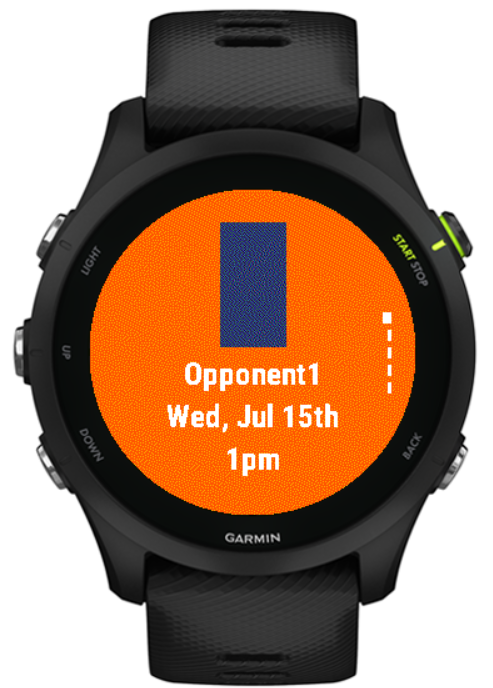
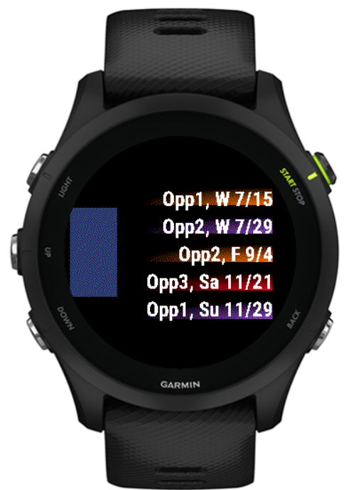

# ScoreWidget

This Garmin Widget displays sports schedule information for any sports team. The schedule information is listed in the json folder so the team, schedule, and images can all be customized.

## Development

See the Garmin documentation for installing the Connect IQ SDK and tools: https://developer.garmin.com/connect-iq/connect-iq-basics/getting-started/. Running from VS code will open the simulator where the widget can be tested.

Images, schedule information, and team names and nicknames can all be found and modified in the resources folder. Schedules should be listed in the UTC time zone in the json file and the app will adjust the time zone based the watch location.

\*Note\*: This was designed for a watch with a 260x260 pixel size, values in the app may need to be adjusted depending on the device.